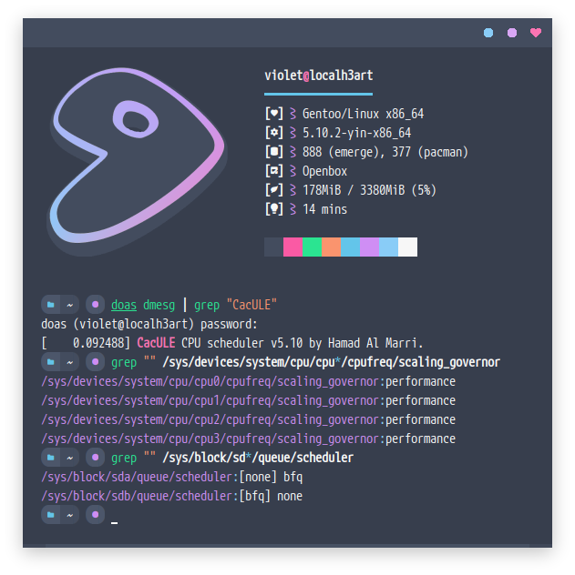
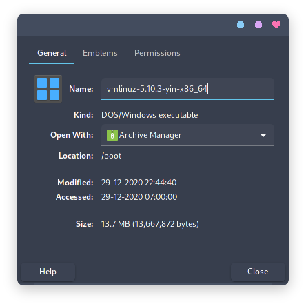
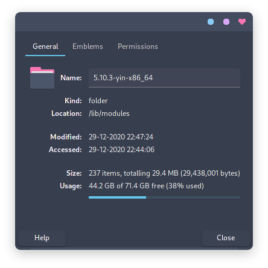

## yin-x86_64 

<p align="center">
  
</p>
<p align="center">🎀 Optimized for multitasking under high load 🎀</p>

## [Kernel Sources](./usr_src_linux)


- LZ4 compressed bzImage
- [Xanmod-CacULE patchset + Gentoo patches](https://gitlab.com/src_prepare/src_prepare-overlay/-/tree/master/sys-kernel/xanmod-sources)
- [Applied suggested configs on CacULE Scheduler](https://github.com/hamadmarri/cacule-cpu-scheduler#suggested-configs)
- Enabled LZ4 swap compressed block as default
- Android binder and ashmem support for Anbox
- AMD SoC only, disabled most intel features
- Governor performance as defaul
- BFQ I/O Scheduler as default
- Custom boot logo ([っ◔◡◔](./usr_src_linux/drivers/video/logo/logo_linux_clut224.ppm))
- 250Hz tick rate

## [Localmodconfig](./home_username_.config) (optional)
- [Modprobed-db](https://github.com/graysky2/modprobed-db)    

---

### Store current module
> **Optional**: If you want minimal kernel
- **References**: [wiki.archlinux/Modprobed-db](https://wiki.archlinux.org/index.php/Modprobed-db)
  ```bash
  modprobed-db store
  ```

### Kernel sources directory
- **Gentoo**: `/usr/src/linux`
  ```bash
  cp .config_yin .config
  make -j`nproc` menuconfig # If you want to adjust yourself again
  
  # Optional, if you want minimal kernel
  # Using the database from modprobed-db to set the module to be used. Adjust <username> to where the database is located.
  make -j`nproc` LSMOD=/home/<username>/.config/modprobed.db localmodconfig
  
  # Make sure this and so on down as root
  make -j`nproc` modules_install
  make -j`nproc` install
  ```

### Generate initramfs (if using)
- **Dracut**  
  Adjust <version> with the kernel version you compiled/use (as root)
  ```bash
  dracut --kver <version> /boot/initramfs-<version>.img --force
  ```
  
> In order for the logo to appear on boot, make sure to use `loglevel=4` in the [kernel parameters](https://wiki.archlinux.org/index.php/Kernel_parameters).

vmlinuz|modules
|--|--|
|

[backup_gentoo_config](https://github.com/owl4ce/hold-my-gentoo)
